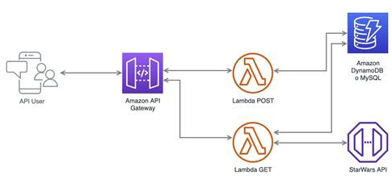

<!--
title: 'Serverless Framework Node Express API service backed by DynamoDB on AWS'
description: 'This template demonstrates how to develop and deploy a simple Node Express API service backed by DynamoDB running on AWS Lambda using the Serverless Framework.'
layout: Doc
framework: v4
platform: AWS
language: nodeJS
priority: 1
authorLink: 'https://github.com/serverless'
authorName: 'Serverless, Inc.'
authorAvatar: 'https://avatars1.githubusercontent.com/u/13742415?s=200&v=4'
-->

# API Express Node con Serverless Framework en AWS

Esta plantilla demuestra cómo desarrollar e implementar un servicio API de Node Express simple, respaldado por una tabla DynamoDB, que se ejecuta en AWS Lambda mediante Serverless Framework.

La plantilla configura una única función, `api`, que maneja todas las solicitudes entrantes mediante el evento `httpApi`. Para obtener más información sobre las opciones de configuración del evento `httpApi`, consulte la documentación del evento [httpApi event docs](https://www.serverless.com/framework/docs/providers/aws/events/http-api/). Como el evento está configurado para aceptar todas las solicitudes entrantes, el framework Express.js se encarga de enrutar y manejar internamente las solicitudes. Esta implementación usa el paquete `serverless-http` para transformar las cargas de solicitud de eventos entrantes en cargas compatibles con Express.js. Para más información sobre `serverless-http`, consulte el [serverless-http README](https://github.com/dougmoscrop/serverless-http).

Además, también se encarga del aprovisionamiento de una base de datos DynamoDB que se utiliza para almacenar datos sobre los usuarios. La aplicación Express.js expone dos puntos finales,, `POST /users/register` y `POST /user/login`, que crean un usuario y puedes ingresar con las credenciales creadas.

Además, se consume la siguiente api  `https://swapi.py4e.com/documentation`.Tenemos las siguientes rutas,, `GET /planets/swapi` y `POST /planets/swapi/:id`, que obtienen los planetas en español.
### Arquitectura
<p align="center">
  
</p>

## Uso

### Despliegue

Instale las dependencias con:

```
npm install
```

y luego despliegue con:

```
serverless deploy
```

Después de ejecutar el despliegue, debería ver una salida similar a:

```
Deploying "aws-node-express-dynamodb-api" to stage "dev" (us-east-1)

✔ Service deployed to stack aws-node-express-dynamodb-api-dev (109s)

endpoint: ANY - https://xxxxxxxxxx.execute-api.us-east-1.amazonaws.com
example: ANY - https://sluyylvtvh.execute-api.us-east-1.amazonaws.com
functions:
  api: aws-node-express-dynamodb-api-dev-api (3.8 MB)
```

_Nota_: En la configuración actual, su API es pública y puede ser invocada por cualquiera. Para despliegues en producción, podría considerar configurar un autorizador. Para obtener detalles sobre cómo hacerlo, consulte la documentación del evento [`httpApi` event docs](https://www.serverless.com/framework/docs/providers/aws/events/http-api/). Además, en la configuración actual, la tabla DynamoDB se eliminará al ejecutar `serverless remove`. Para conservar la tabla DynamoDB incluso después de eliminar la pila, agregue `DeletionPolicy: Retain` en la definición del recurso.
### Invocation

Después de un despliegue exitoso, puede crear un nuevo usuario llamando al endpoint correspondiente:

```
curl --request POST 'https://sluyylvtvh.execute-api.us-east-1.amazonaws.com/users/register' --header 'Content-Type: application/json' --data-raw '{"email": "user@example.com","name": "TuNombre","password":"tuPassword" }'
```

Lo que debería resultar en la siguiente respuesta:

```json
{
  "success": true,
  "message": "Se creo usuario: user@example.com con exito"
}
```

Luego puede ingresar con su usuario en el siguiente endpoint:

```
curl https://sluyylvtvh.execute-api.us-east-1.amazonaws.com/users/login --header 'Content-Type: application/json' --data-raw '{"email": "tuemail@example.com","password":"tuPassword" }'
```

Lo que debería resultar en la siguiente respuesta:

```json
{
  "success": true,
  "token": "token",
  "message": "Bienvenido: Tu Nombre Apellido "
}
```
Luego puede ingresar con su el token para hacer las peticiones en las siguientes rutas como :

```
curl https://sluyylvtvh.execute-api.us-east-1.amazonaws.com/planets/swapi 
```
```
curl https://sluyylvtvh.execute-api.us-east-1.amazonaws.com/planets/swapi/1
```
### Desarrollo Local

La forma más fácil de desarrollar y probar su función es usar el comando `dev`:
```
serverless dev
```
Esto iniciará un emulador local de AWS Lambda y canalizará sus solicitudes hacia y desde AWS Lambda, permitiéndole interactuar con su función como si estuviera ejecutándose en la nube.

Ahora puede invocar la función como antes, pero esta vez se ejecutará localmente. Puede desarrollar su función localmente, invocarla y ver los resultados de inmediato sin necesidad de volver a desplegarla.

Cuando termine de desarrollar, no olvide ejecutar `serverless deploy` para desplegar la función en la nube.

